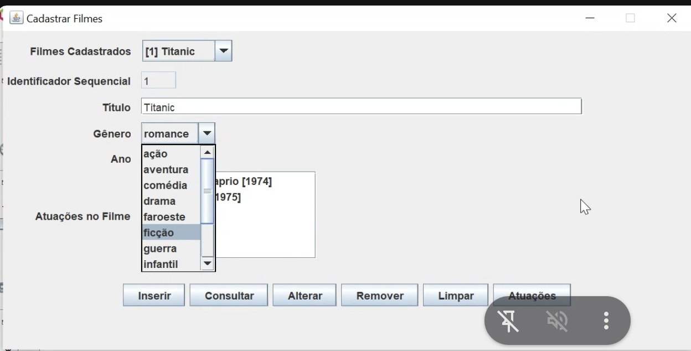
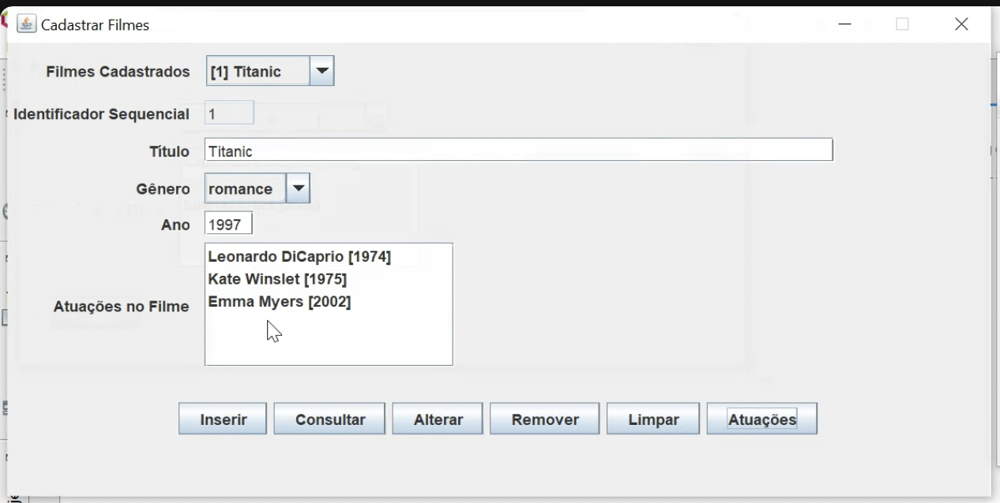
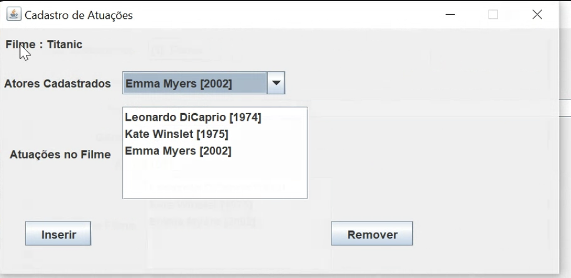
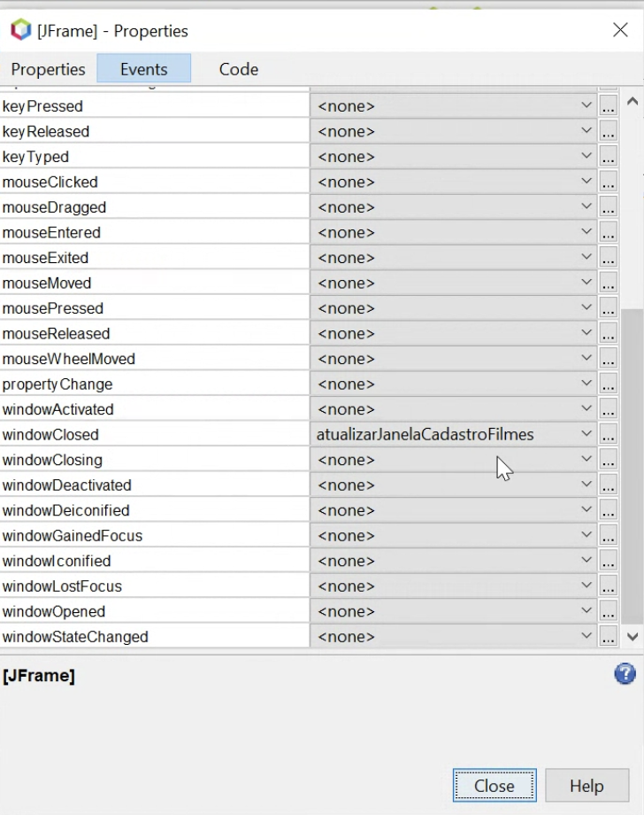

| Papel lógico | Música 🎼 | Lançamentos de carros | Avaliação de filmes | Divulgação de Livros | Seguro 🚗 |
| -------------- | -------------- | ---------------------- | ------------------- | -------------------- | -------------------- |
| Ação | Apresentação | Lançamento | Avaliações | Mostra | Orçamento |
| Agente/Destino | Maestro | Agência de publicidade | Amigos | Editora | Seguradora |
| Contexto | Repertório | Montadora | Filme | Autor | Sinistro |
| Objetos | Peças musicais | Veículos | Ator | Livros | Peças (do carro etc) |
  
Frases:  
	1. Apresentação de peças musicais do repertório de um maestro  
	2. Lançamentos de veículos de uma montadora por uma agência de Publicidade  
	3. Orçamentos de peças de um sinistro por uma seguradora  
  
  
Peças (atributos):  
	código  
	nome  
	categoria  
	preco  
	mão_obra_própria  
	tipo, dias_de_garantia  
	tipo, cor  
  
Sinistro (atributos)  
  
Seguradora (atributos):  
	nome  
	cidade  
	cobertura_percentual  
  
A chave do “filme” vai ser gerada sequencialmente pelo banco, automaticamente  
  
  
  
  
Checkbox, combobox e um radio em pelo menos 1 das entidades  
  
A entidade Sinistro tem que ter um liste para colocar o objetos de peça  
  
  
  
Tem que chamar uma função que atualiza a lista de peças dentro do sinistro  
  
  
Próximos passos:  
    1. Uma entidade a mais chamada “PeçasDoOrçamento”  
    2. Uma Interface a mais par “PeçasDoOrçamento”  
    3. Provavelmente mais um controlador para “PeçasDoOrçamento”  
    4. Precisa ter a janela mãe declarado, no caso sinistro  
